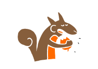
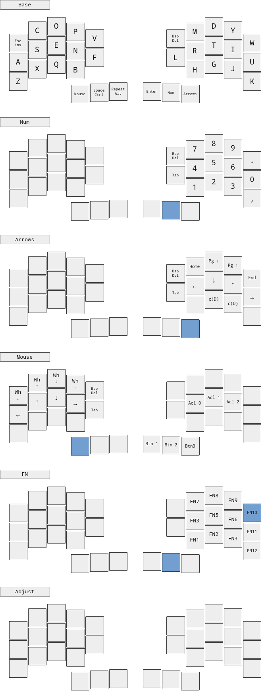

## CHEW KEYMAP

    

This keymap has been made for the [chew](https://github.com/flinguenheld/chew) keyboard.  
It is inspired by [Ergo-L](https://ergol.org/) which is a French layout.  
Nonetheless it uses the [US international extended](https://github.com/qmk/qmk_firmware/blob/master/quantum/keymap_extras/keymap_us_extended.h) keymap for French keys.  

It makes use of the _best_ qmk features :
- combos ❤️
- auto shift
- leader key

### Install

Clone this repo in the folder :

    ~/qmk_firmware/keyboards/chew/keymaps/

Then :

    qmk compile && qmk flash

Finally press twice the *reset* button, the controller should appear in your file explorer.  

Check the [Chew wiki](https://github.com/flinguenheld/chew/wiki) for more information.

---

### Layouts

    
    

    

### Leader

| ------------------ | -------- | ------------------ | -------- | ------------------ | -------- |
| :----------------: | :------- | :----------------: | :------- | :----------------: | :------- |
|     C + O + P      | ©        |     M + U + L      | ×        |     L + O + V      | ♥        |
|     R + E + G      | ®        |     D + I + V      | ÷        |     F + L + A      | ⚡       |
|     D + I + A      | ø        |       P + M        | ±        |     S + T + A      | ✶        |
|     D + E + G      | °        |     I + N + E      | ≠        |     B + U + L      | 💡       |
|     S + E + C      | §        |     A + L + M      | ≈        |     I + N + F      | ℹ️        |
|     P + O + U      | £        |     S + Q + U      | √        |     G + E + A      | ⚙️        |
|     Y + E + N      | ¥        |     I + N + F      | ∞        |         V          | ✓        |
|     C + E + N      | ¢        |       < + <        | ≤        |       V + B        | ✔        |
|     B + E + T      | ß        |       > + >        | ≥        |       V + V        | ✅       |
|     M + I + C      | µ        |     F + C + T      | ¼        |         X          | ✗        |
|       P + I        | π        |     F + C + G      | ½        |       X + B        | ✘        |
|     O + M + E      | Ω        |     F + H + T      | ¾        |         ?          | ❔       |
|     U + P + F      | ⁰        |                    |          |       ? + ?        | ❓       |
|     D + N + F      | ₀        |                    |          |         !          | ❕       |
|                    |          |                    |          |       ! + !        | ❗       |
